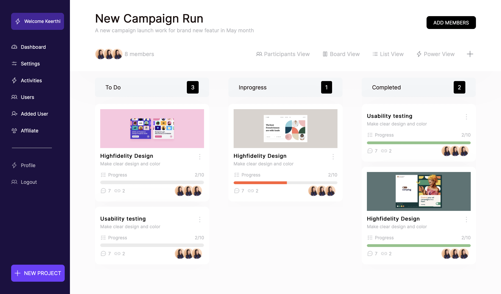

# New Campaign Run
## A webpage of a new campaign launch work for brand new feature in May month
 

# Code Structure
This webpage was built with Vite, React and SASS. The 'index.html' is the root of the webpage. The assets folder contains the components of the web app, all images and the sass code too.

 

# Difficulties Encountered
I didn't have so much trouble during the build of this. It was my first time working with Vite, and I had a seamless transition to it.   The only issues were during the deploy of this site. The deploy was case sensitive when considering the name of the images.

 

## A screenshot of the webapp:

 

This site is optimised for all screens greater than 1200px. [Here is a link to the optimised site](https://campaign-ileri.netlify.app).

